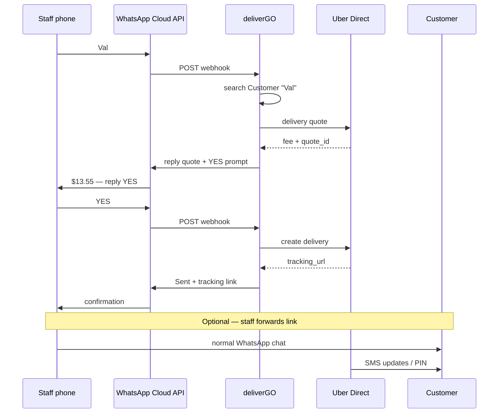

# deliverGO — WhatsApp Staff Dispatch (Option 4)

> Staff text a WhatsApp number → deliverGO quotes and creates deliveries → staff forwards tracking to customers.  
> Check off tasks with `[x]` as they are completed.

**Related docs:** [IMPLEMENTATION.md](./IMPLEMENTATION.md) · [ARCHITECTURE.md](./ARCHITECTURE.md) · [README.md](./README.md)

---

## Decisions (locked for v1)

| Decision | Choice |
|----------|--------|
| Scope | **Option 4** — staff-facing bot only (not customer self-serve in v1) |
| Platform | **Meta WhatsApp Cloud API** (direct; no BSP required for MVP) |
| Bot UX | Plain-text commands (`Val`, `YES`) — no slash required |
| Auth | Allowlisted staff phone numbers per store (E.164) |
| Customer data | Reuse **Customers** module (match by name / phone / address) |
| Delivery logic | Reuse `createQuote` + `createDelivery` services (same as dashboard) |
| Conversation state | Short-lived server-side session (pending quote → confirm) |
| Customer updates | Staff forwards tracking link on normal WhatsApp; Uber SMS unchanged |
| n8n / Make | **Out of scope** — logic lives in deliverGO (not Option 5) |

---

## What “bot” means (not Telegram, not a separate app)

The bot is **a WhatsApp phone number** connected to the Cloud API. Staff save it as a contact (e.g. “deliverGO Dispatch”) and chat like any other thread.

| Telegram | deliverGO WhatsApp (Option 4) |
|----------|-------------------------------|
| Chat with `@MyBot` | Chat with **business phone number** |
| `/send Val` | `Val` or `send Val` |
| Bot replies instantly | Same — webhook → deliverGO → reply API |

Customers do **not** need to talk to the bot in v1. Only staff use it to dispatch.

---

## End-to-end flow

### Actors

| Actor | Role |
|-------|------|
| **Staff** | Store manager phone(s) on allowlist |
| **Bot number** | Meta WhatsApp Business API number (test number in dev) |
| **deliverGO** | Parses messages, quotes, creates delivery |
| **Uber Direct** | Fulfillment + customer SMS (PIN, etc.) |
| **Customer** | Orders via normal WhatsApp with store; may get Uber SMS |

### Happy path



### Message examples

**Staff → bot**

```text
Val
```

**Bot → staff**

```text
Val T
123 Roger St, Waterloo
Uber Direct — $13.55 · ~25 min
Reply YES to send
```

**Staff → bot**

```text
YES
```

**Bot → staff**

```text
Sent ✓
Track: https://delivery.uber.com/...
Ref: DG-1780491311157-8e3b6183
```

---

## Architecture

```
┌──────────────┐     ┌─────────────────────────────────────────┐
│ Staff phone  │────▶│ Meta WhatsApp Cloud API                   │
└──────────────┘     │  (webhook + send message API)             │
                     └──────────────────┬──────────────────────┘
                                        │ HTTPS webhook
                                        ▼
                     ┌─────────────────────────────────────────┐
                     │ deliverGO                                  │
                     │  app/api/webhooks/whatsapp                 │
                     │       ↓                                    │
                     │  handle-whatsapp-message (service)         │
                     │       ↓                                    │
                     │  conversation session + command parser     │
                     │       ↓                                    │
                     │  createQuote / createDelivery (existing)     │
                     │  upsertCustomerFromDropoff (existing)        │
                     └──────────────────┬──────────────────────┘
                                        │
                                        ▼
                              Uber Direct / DoorDash
```

**Layer placement (per [ARCHITECTURE.md](./ARCHITECTURE.md))**

| Layer | Path |
|-------|------|
| Integration | `lib/integrations/whatsapp/` — verify webhook, send message, parse payload |
| Domain | `lib/domain/whatsapp/` — commands, session types, validation |
| Services | `lib/services/whatsapp/` — orchestration, allowlist, conversation FSM |
| API | `app/api/webhooks/whatsapp/route.ts` |
| DB | `WhatsAppStaffPhone`, `WhatsAppConversation` (or Redis later) |

---

## Meta developer setup (free sandbox)

### Where to configure

| Resource | URL |
|----------|-----|
| Developer portal | https://developers.facebook.com/ |
| Create app | https://developers.facebook.com/apps/ |
| Cloud API docs | https://developers.facebook.com/docs/whatsapp/cloud-api/ |
| Get started | https://developers.facebook.com/docs/whatsapp/cloud-api/get-started/ |
| Pricing | https://developers.facebook.com/docs/whatsapp/pricing |

### Sandbox checklist (before coding)

- [ ] Meta Developer account created
- [ ] App created (type **Business**) with **WhatsApp** product added
- [ ] **API Setup** page: note `Phone number ID`, `WABA ID`
- [ ] Add up to **5 test recipient** staff numbers (OTP verify)
- [ ] Send test message from dashboard → received on staff phone
- [ ] Reply to test message → opens 24h **service window** for free-form replies
- [ ] Create **System User** + permanent token (not 24h temp token)
- [ ] Webhook URL pointed at deliverGO (requires public HTTPS — Vercel or ngrok for local)

### Free vs paid (expectations)

| Item | Dev / test | Production |
|------|------------|------------|
| API access | Free | Free (no Meta subscription) |
| Test WABA + test number | Free | N/A |
| Messages to 5 test numbers | Free | N/A |
| Real business number on API | N/A | Business verification + registration |
| Staff replies in 24h window | Low / often free tier | Per Meta conversation pricing |
| Cold outbound to staff | Paid templates | Avoid — staff messages bot first |

**Option 4 cost pattern:** staff always messages the bot first → bot replies inside service window → minimal template cost.

---

## Conversation state machine

| State | Trigger | Bot behavior |
|-------|---------|--------------|
| `idle` | — | Wait for command |
| `awaiting_confirm` | Customer name matched + quote OK | Show fee; accept `YES` / `CANCEL` |
| `awaiting_address_pick` | Customer has multiple addresses | Reply `1`, `2`, … |
| `awaiting_provider_pick` | Multiple quotes (Uber + DoorDash) | Reply `1` Uber, `2` DoorDash |

**Session storage:** `WhatsAppConversation` row keyed by `(storeId, staffPhoneE164)` with TTL ~30 min and `quoteId`, `customerId`, `pendingPayload` JSON.

**Cancel / reset:** `CANCEL`, `HELP`, or new customer name clears session.

---

## Commands (v1)

| Input | Action |
|-------|--------|
| `HELP` | List commands |
| `{name}` or `send {name}` | Fuzzy match customer by name (store scope) |
| `1`, `2`, … | Pick address or provider when prompted |
| `YES` | Confirm pending quote → `createDelivery` |
| `CANCEL` | Clear session |

**Not in v1:** free-text address parsing, customer-initiated dispatch (Option 3).

---

## Database (Phase 15.1)

### Store extensions

- [ ] `whatsappPhoneNumberId` — Meta Phone number ID for this store’s bot line
- [ ] `whatsappEnabled` — boolean (default `false`)

### WhatsAppStaffPhone

- [ ] `id`, `storeId`, `phoneE164`, `label` (optional), `createdAt`
- [ ] Unique `(storeId, phoneE164)`
- [ ] Only these numbers may trigger dispatch

### WhatsAppConversation

- [ ] `id`, `storeId`, `staffPhoneE164`, `state`, `payload` JSON, `expiresAt`, `updatedAt`
- [ ] Index `(storeId, staffPhoneE164)`

### Delivery (optional link)

- [ ] `source` enum or string: `dashboard` \| `whatsapp` (optional analytics)

---

## Environment variables

Add to `.env.example` and README:

```bash
# WhatsApp Cloud API (Meta)
WHATSAPP_ENABLED="false"
WHATSAPP_ACCESS_TOKEN=""           # System user token
WHATSAPP_APP_SECRET=""             # App secret — webhook signature verify
WHATSAPP_VERIFY_TOKEN=""           # Custom string for GET webhook verification
WHATSAPP_PHONE_NUMBER_ID=""        # Default for single-store dev; per-store in DB for prod
WHATSAPP_BUSINESS_ACCOUNT_ID=""    # WABA ID (optional logging)
WHATSAPP_API_VERSION="v21.0"       # Graph API version
```

---

## Phase 15.0 — Meta account & webhook plumbing

- [x] Document Meta setup in README (link to this file)
- [x] Add env vars to `.env.example`
- [x] `lib/integrations/whatsapp/config.ts` — load + validate env
- [x] `lib/integrations/whatsapp/webhook.ts`
  - [x] `verifyWebhookChallenge(GET)` — Meta hub.verify_token handshake
  - [x] `verifyWebhookSignature(POST)` — `X-Hub-Signature-256` HMAC
  - [x] `parseIncomingMessage(payload)` — extract `from`, `text`, `message_id`
- [x] `lib/integrations/whatsapp/client.ts`
  - [x] `sendTextMessage(to, body)` → Graph API `/{phone-number-id}/messages`
- [x] `app/api/webhooks/whatsapp/route.ts`
  - [x] `GET` — verification
  - [x] `POST` — verify signature → enqueue or handle → return 200 quickly
- [ ] Manual test: echo bot replies `pong` to any allowlisted `ping` *(needs Meta credentials + ngrok)*

---

## Phase 15.1 — Staff allowlist & store mapping

- [x] Migration: `WhatsAppStaffPhone`, store WhatsApp fields, `WhatsAppConversation`
- [x] `lib/db/repositories/whatsapp.repository.ts`
- [x] Dashboard: Store profile section — enable WhatsApp, manage staff numbers (or seed-only for MVP)
- [x] `resolveStoreFromWebhook(phoneNumberId)` — map Meta number → `storeId` (`findStoreByPhoneNumberId`)
- [x] `isStaffAllowed(storeId, phoneE164)` — gate all commands

---

## Phase 15.2 — Command parser & customer lookup

- [x] `lib/domain/whatsapp/types.ts` — parse `HELP`, `YES`, `CANCEL`, name tokens + session states
- [x] `lib/services/whatsapp/lookup-customer.ts`
  - [x] Search by name (reuse customer search logic)
  - [x] Single match → primary phone + primary address
  - [x] Multiple matches → disambiguation list
  - [x] Multiple addresses → numeric picker
- [x] Unit tests: command parser *(session FSM transitions: manual E2E)*

---

## Phase 15.3 — Quote flow

- [x] `lib/services/whatsapp/handle-incoming-message.ts` — main orchestrator
- [x] On customer resolved:
  - [x] Call existing quote path (`createQuoteForStore`)
  - [x] Store `quoteId`, provider, fee, ETA in conversation session
  - [x] Reply formatted quote message
- [x] Handle quote failures (user-friendly copy, no stack traces)
- [x] Handle expired quote on `YES` → re-quote automatically *(via `createDeliveryForStore` QUOTE_EXPIRED path)*

---

## Phase 15.4 — Confirm & create delivery

- [x] On `YES` in `awaiting_confirm`:
  - [x] Call `createDeliveryForStore` with session payload + default POD (picture + pincode)
  - [x] `upsertCustomerFromDropoff` (already on create path)
  - [x] Set `source: whatsapp`
  - [x] Reply with tracking URL + external ID
- [x] Idempotency: duplicate `message_id` from Meta → ignore (via `WebhookEvent`)
- [x] On failure: reply with short error + `CANCEL` hint

---

## Phase 15.5 — Security & reliability

- [x] Reject webhooks with invalid signature (401)
- [x] Reject messages from non-allowlisted phones (“Not authorized” reply)
- [x] Rate limit per staff phone (reuse `checkRateLimit`)
- [x] Log webhook events (no full phone numbers in rate-limit logs)
- [x] Return 200 to Meta within 5s (sync handler; async job later if needed)

---

## Phase 15.6 — Production readiness

- [ ] Meta Business Verification completed
- [ ] Register real store business number on Cloud API
- [ ] Move from test WABA to production WABA
- [ ] Permanent system user token rotation documented
- [ ] Webhook URL on production domain (`NEXT_PUBLIC_APP_URL`)
- [ ] Staff onboarding doc: save bot contact, send `HELP`

---

## Phase 15.7 — Testing

- [x] Unit: webhook signature verification
- [x] Unit: command parser
- [ ] Unit: customer name lookup edge cases
- [ ] Integration: mocked Graph API send + mocked Uber quote/create
- [ ] Manual E2E (Meta test number):
  - [ ] Allowlist staff phone
  - [ ] `Val` → quote message
  - [ ] `YES` → delivery in dashboard + tracking reply
  - [ ] `CANCEL` clears state
  - [ ] Non-allowlisted phone rejected

---

## Future (post Phase 15 — not v1)

- [ ] **Option 3** — customer-initiated messages on same or separate line
- [ ] Status push to staff on Uber webhook (`dapi.status_changed`) — “Val’s order delivered”
- [ ] Interactive buttons (WhatsApp reply buttons) instead of `YES` text
- [ ] Multi-store routing from one bot number
- [ ] Redis for conversation sessions at scale

---

## Progress tracker

| Sub-phase | Name | Status |
|-----------|------|--------|
| 15.0 | Meta + webhook plumbing | [x] *(manual ping pending Meta setup)* |
| 15.1 | Allowlist & store mapping | [x] |
| 15.2 | Commands & customer lookup | [x] |
| 15.3 | Quote flow | [x] |
| 15.4 | Confirm & create delivery | [x] |
| 15.5 | Security & reliability | [x] |
| 15.6 | Production readiness | [ ] |
| 15.7 | Testing | [ ] *(unit core done; E2E pending)* |

---

## Reference links

### Meta / WhatsApp

- [WhatsApp Cloud API overview](https://developers.facebook.com/docs/whatsapp/cloud-api/)
- [Get started](https://developers.facebook.com/docs/whatsapp/cloud-api/get-started/)
- [Webhooks setup](https://developers.facebook.com/docs/whatsapp/cloud-api/guides/set-up-webhooks)
- [Send messages API](https://developers.facebook.com/docs/whatsapp/cloud-api/reference/messages)
- [Pricing](https://developers.facebook.com/docs/whatsapp/pricing)
- [Business verification](https://developers.facebook.com/docs/development/release/business-verification)

### deliverGO dependencies (already built)

- Customers module — `lib/services/customer/`, `lib/db/repositories/customer.repository.ts`
- `createQuote` / `createDelivery` — `lib/services/delivery/`
- Uber webhooks pattern — `lib/services/delivery/handle-uber-webhook.ts`
